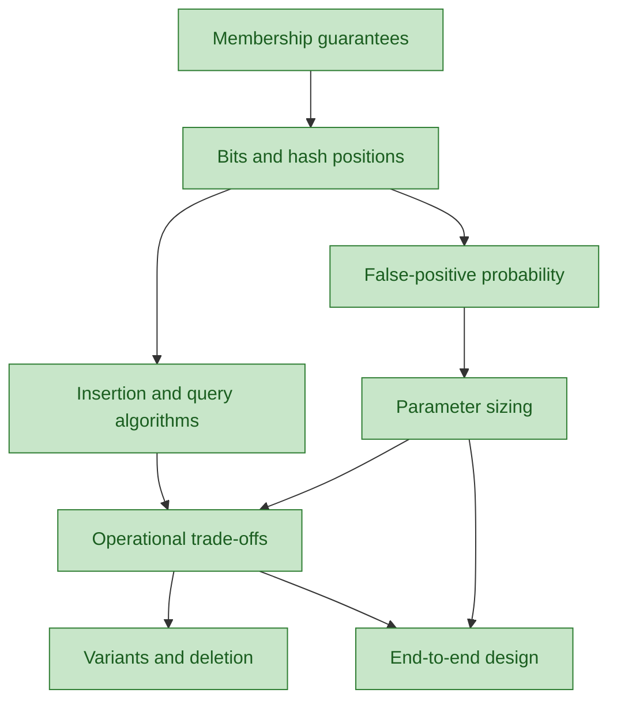

# Bloom filters

## Goal
Use Bloom filters safely to reduce expensive membership lookups: explain their guarantees, estimate false-positive risk, and choose parameters for a workload.

## Knowledge graph

## Learning path
- [x] [[nodes/N01-membership-guarantees|N01 — Membership guarantees]]
- [x] [[nodes/N02-bits-and-hash-positions|N02 — Bits and hash positions]]
- [x] [[nodes/N03-false-positive-probability|N03 — False-positive probability]]
- [x] [[nodes/N04-parameter-sizing|N04 — Parameter sizing]]
- [x] [[nodes/N05-insertion-and-query-algorithms|N05 — Insertion and query algorithms]]
- [x] [[nodes/N06-operational-trade-offs|N06 — Operational trade-offs]]
- [x] [[nodes/N07-variants-and-deletion|N07 — Variants and deletion]]
- [x] [[nodes/N08-end-to-end-design|N08 — End-to-end design]]

## Diagnostic summary
| Node | Evidence | Notes |
|---|---|---|
| N01 — Membership guarantees | solid | Correctly distinguished negative certainty from false-positive positives; applied it to disk lookup. |
| N02 — Bits and hash positions | mastered with effort | Corrected the all-bits rule; then applied a possible positive safely. |
| N03 — False-positive probability | mastered with effort | Connected growth and excess hashes to occupancy; chose capacity recovery. |
| N04 — Parameter sizing | mastered easily | Preserved bits per item and recomputed the hash count. |
| N05 — Insertion and query algorithms | mastered easily | Explained the query/insert distinction and caught mismatched hashing. |
| N06 — Operational trade-offs | mastered with effort | Identified the suitable workload and the completeness condition for safe negatives. |
| N07 — Variants and deletion | mastered with effort | Resolved shared-contribution deletion and counter-memory trade-offs. |
| N08 — End-to-end design | mastered easily | Designed a complete prefilter with safe negatives and verified positives. |
| Course synthesis | mastered | Combined sizing, validity conditions, and authoritative verification. |

## Reference
- [[knowledge-base|Comprehensive Knowledge Base]]

## Sources

- No external sources used; this course begins with stable fundamentals.