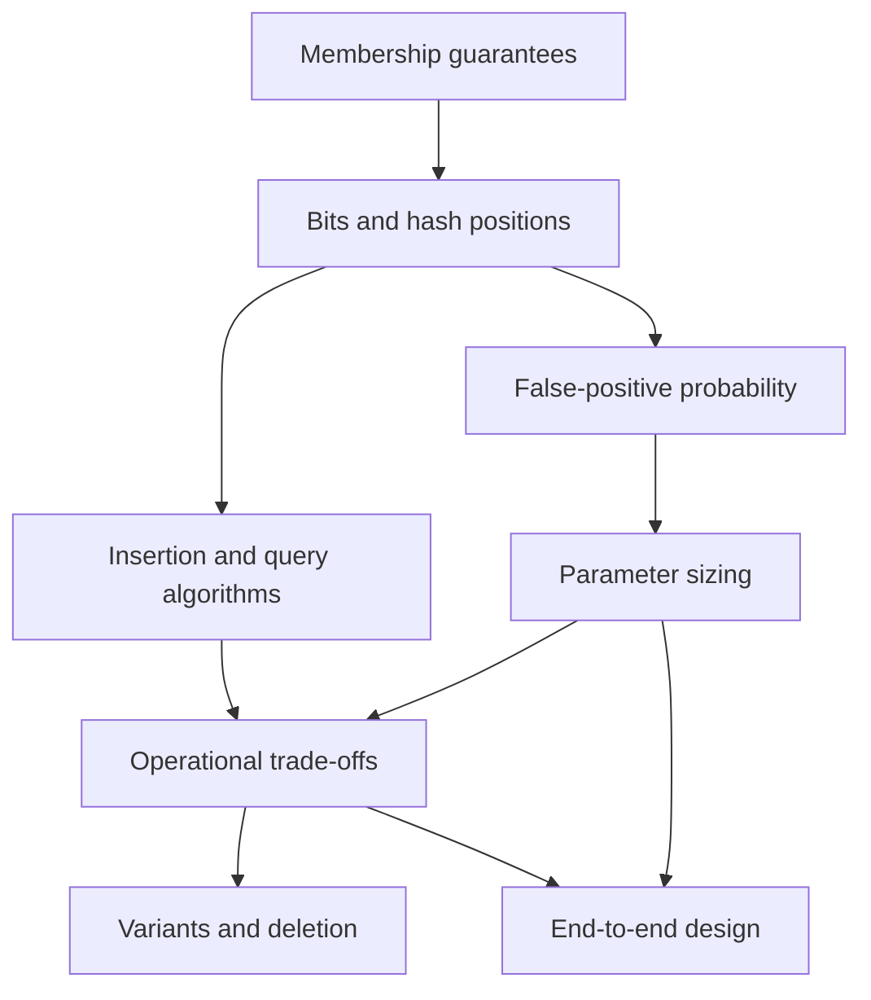

# Bloom filters Knowledge Base

## Executive summary
A Bloom filter is a compact probabilistic prefilter for set membership. It can prove that a key is absent from the represented set, but a positive result means only *possibly present*. Its practical purpose is to avoid expensive authoritative checks—such as disk reads, network requests, or computation—when negative lookups dominate.

The central design rule is simple: use a negative to skip work only when the filter is complete and current for the membership set being queried; always verify a positive in the authoritative store. Size the bit array from expected cardinality and a false-positive budget, and treat growth, staleness, and deletion semantics as part of the correctness contract.

## Knowledge graph

## Core concepts

### [[nodes/N01-membership-guarantees|N01 — Membership guarantees]]
A Bloom filter gives a one-sided answer:

- **negative:** the key is definitely absent, provided the filter fully represents the relevant set;
- **positive:** the key may be present and requires authoritative verification.

This asymmetry is not a defect. It is the mechanism that exchanges a controlled number of unnecessary positive-path checks for much lower memory use than an exact set.

### [[nodes/N02-bits-and-hash-positions|N02 — Bits and hash positions]]
A filter has $m$ bits and $k$ position functions. For key $x$, each function maps $x$ to one position in $[0,m)$.

- **Insert:** set all $k$ selected bits to 1.
- **Query:** if any selected bit is 0, return definitely absent; if all are 1, return possibly present.

The filter stores neither original keys nor per-key hash values. Different keys can select overlapping positions. That lost identity is precisely why positives are approximate.

### [[nodes/N03-false-positive-probability|N03 — False-positive probability]]
False positives arise when an unseen key happens to select only bits already set by other insertions. After $n$ inserted items, with $m$ bits and $k$ positions per key:

$$P(\text{bit is 0}) \approx e^{-kn/m}$$
$$P(\text{false positive}) \approx (1-e^{-kn/m})^k$$

The approximation is useful for planning. At fixed $m$ and $k$, adding items increases bit occupancy and therefore false-positive probability. Increasing $k$ helps only up to an optimum; past that point it fills the array faster and worsens the rate.

### [[nodes/N04-parameter-sizing|N04 — Parameter sizing]]
For expected cardinality $n$ and target false-positive probability $p$:

$$m \approx \frac{-n\ln p}{(\ln2)^2}\ \text{bits}$$
$$k \approx \frac{m}{n}\ln2$$

Round $k$ to a practical integer and choose an implementation that deterministically derives those positions. The key planning quantity is bits per expected item: holding $p$ constant means memory grows roughly linearly with $n$.

### [[nodes/N05-insertion-and-query-algorithms|N05 — Insertion and query algorithms]]
Insertion must visit every selected position and set it. Query may short-circuit at the first selected 0: no later position can overturn that proof of absence. Both operations are $O(k)$ in hash and bit work; storage is $m$ bits.

The insert and query paths must use identical key normalization, hashing, seeds, and position reduction. A mismatch can make an inserted key query positions never set for it, violating the no-false-negative guarantee.

### [[nodes/N06-operational-trade-offs|N06 — Operational trade-offs]]
Use a Bloom filter when all of these hold:

1. many requests are for absent keys;
2. authoritative checks are materially costly;
3. a positive can safely be verified; and
4. the filter can remain sufficiently complete and current.

Observe cardinality growth, saturation or bit occupancy, and the verified-positive rate. A rising fraction of positives rejected by the authoritative store indicates increasing false-positive cost. Rebuild, replace, or add a layer before that overhead makes the filter counterproductive.

### [[nodes/N07-variants-and-deletion|N07 — Variants and deletion]]
A plain Bloom filter cannot safely delete an item by clearing its selected bits: other items may share those bits, and clearing one can make another inserted key appear absent.

A counting Bloom filter stores a small counter at each position. Insertion increments each selected counter; deletion decrements each selected counter. This preserves shared contributions but uses more memory and introduces counter-width and safe-delete considerations. It still permits false positives.

### [[nodes/N08-end-to-end-design|N08 — End-to-end design]]
A robust deployment specifies the authoritative store, expected cardinality, false-positive target, update/deletion model, lifecycle and scaling policy, failure fallback, and observability. The critical safety condition is not merely a good false-positive rate: it is that the filter’s represented set has the same membership semantics and freshness required by the lookup.

## Cross-concept synthesis
The conceptual chain is: hash positions explain the one-sided membership guarantee; the expected occupancy of those positions yields the false-positive rate; sizing controls that rate; correct algorithms preserve the guarantee; and the operational design decides whether the guarantee may safely influence real system behavior.

A filter with excellent mathematical sizing is still unsafe if the query path uses different hashing, or if the filter omits records that authoritative lookup would find. Conversely, a complete, current filter can safely save expensive negative checks even though every positive remains approximate.

## Methods and decision rules

| Decision | Rule |
|---|---|
| Use a Bloom filter | Negative lookups are common, source-of-truth checks are costly, and positives can be verified. |
| Trust a negative | Only when the filter is complete and current for the exact relevant membership set. |
| Handle a positive | Verify it against the authoritative store. |
| Set capacity | Estimate maximum active cardinality $n$, choose tolerated $p$, calculate $m$ and $k$. |
| Respond to growth | Rebuild or add a correctly sized layer; do not attempt to fix saturation by arbitrarily increasing $k$. |
| Support deletion | Use a counting or another deletion-capable variant; never clear plain-filter bits per removed key. |
| Handle unavailable or stale state | Bypass the filter and perform the authoritative lookup. |

## Worked examples

### Immutable segment lookup
A storage engine has immutable segments on slow storage. Build one complete Bloom filter per segment from that segment’s keys. For an ID query, consult each segment filter first:

- filter negative → do not open that segment;
- filter positive → open the segment and perform exact lookup.

Because each segment is immutable and its filter is built from its complete key set, negatives are safe.

### Cache-backed dynamic catalog
A catalog changes continuously, while a background process refreshes a cached Bloom filter. The cached filter may omit recent additions. In this state, a negative cannot safely suppress a current catalog lookup. Treat the filter as an optional positive-path hint or bypass it until freshness is guaranteed; never use its negative as absence proof.

### Deletion-capable active set
An active-session index needs insertions and removals. A plain Bloom filter can prefilter only if stale historical entries are acceptable as extra positives. If removal semantics matter, use counting cells: remove exactly one contribution at every selected position, preserve any remaining count, and guard against counter overflow.

## Practical applications
- Avoid negative key reads in storage engines and distributed key-value clients.
- Pre-screen IDs before remote metadata or object-store requests.
- Reduce unnecessary probes in immutable indexes, log segments, and large read-mostly datasets.
- Filter candidate work in pipelines where authoritative validation remains available.

They are a poor fit for range queries, for cases where an unverified positive must be exact, or for dynamic data when the filter’s freshness cannot be established and negatives would hide valid results.

## Common pitfalls
- Treating a possible positive as proof of membership.
- Trusting negatives from a stale, partial, or differently scoped filter.
- Using different normalization, hash seeds, or position calculations during insertion and query.
- Assuming more hash positions always reduce false positives.
- Sizing for present cardinality but ignoring future growth.
- Clearing bits in a standard Bloom filter to delete one item.
- Forgetting that counting cells trade additional memory and bounded counter range for deletion support.

## Glossary

| Term | Meaning |
|---|---|
| Authoritative store | Exact source of truth used to validate possible positives. |
| Bit occupancy | Fraction of the bit array that is set. |
| Complete filter | A filter containing every relevant member for the lookup semantics. |
| Counting Bloom filter | A variant with per-position counters that supports safe contribution removal. |
| False negative | Reporting absence for an inserted/relevant key; standard insert-only Bloom filters must avoid this. |
| False positive | Reporting possibly present for a key not actually in the authoritative set. |
| $k$ | Number of hash-derived positions per key. |
| $m$ | Number of bits in the filter. |
| Saturation | High bit occupancy that makes positives frequent and the filter less useful. |

## Frequently asked questions

### Does a Bloom filter replace a set or database index?
No. It is a prefilter. The authoritative store retains identity and exact membership.

### Can a Bloom filter return false negatives?
A standard insert-only filter should not, provided insertion/query mapping matches and the filter is complete for the relevant set. Application-level false negatives become possible when the filter is stale, partial, or mismatched.

### How many hash functions should be used?
Derive $k\approx(m/n)\ln2$ from expected capacity and target error rate. Do not pick a large number by intuition alone.

### Can items be removed?
Not safely from a plain filter. Use a counting variant or accept that historical entries may remain as extra positives.

### What happens when the filter fills up?
False positives rise. Rebuild or add a correctly sized layer rather than treating positives as exact or blindly adding hashes.

## Retrieval and practice prompts
1. Explain why one queried 0 bit proves absence in an insert-only, complete filter.
2. Predict how false-positive probability changes when $n$ doubles while $m$ and $k$ remain fixed.
3. Given expected $n$ and target $p$, state how to choose $m$ and $k$.
4. Diagnose the effect of changing a hash seed only in the query path.
5. Design a lookup path for a stale filter and explain why its negative is or is not safe.
6. Explain why a plain filter cannot clear bits for deletion and how counters change the invariant.
7. Propose observability signals that reveal when a deployed filter needs rebuilding.

## Further study
- Scalable Bloom filters for unbounded growth.
- Cuckoo filters and quotient filters as alternative approximate membership structures.
- Cache coherence and versioning strategies for distributing membership prefilters.
- Hash-quality testing and adversarial-input considerations in exposed systems.

## Sources
No external sources were needed: this knowledge base covers stable Bloom-filter fundamentals.