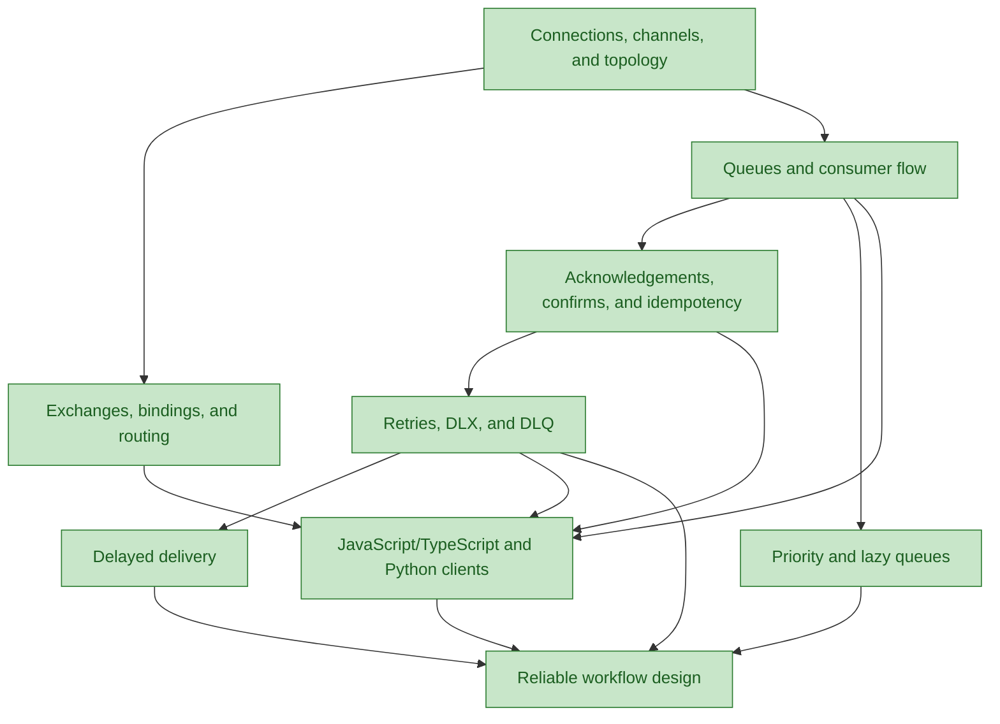

# RabbitMQ Application Integration

## Goal
Design and implement reliable RabbitMQ producers and consumers in JavaScript/TypeScript and Python: choose topology and queue semantics, route messages, control retries and delays, and diagnose delivery failures.

## Scope
This course covers RabbitMQ's AMQP 0-9-1 application-facing model: connections and channels; exchanges, bindings, routing keys, queues, acknowledgements, confirms, retry/DLX paths, delayed delivery, priority queues, the historical lazy-queue setting, and code in amqplib and Pika. It does not teach broker installation, clustering, access control, federation, streams, or generic distributed-systems theory beyond what reliable handlers require. The primary target is practical application integration; operational policy is introduced only where it changes application behavior.

## Knowledge graph

## Learning path
- [x] [[nodes/N01-connections-channels-topology|N01 — Connections, channels, and topology]]
- [x] [[nodes/N02-exchanges-bindings-routing|N02 — Exchanges, bindings, and routing]]
- [x] [[nodes/N03-queues-consumer-flow|N03 — Queues and consumer flow]]
- [x] [[nodes/N04-acknowledgements-confirms-idempotency|N04 — Acknowledgements, confirms, and idempotency]]
- [x] [[nodes/N05-retries-dlx-dlq|N05 — Retries, DLX, and DLQ]]
- [x] [[nodes/N06-delayed-delivery|N06 — Delayed delivery]]
- [x] [[nodes/N07-priority-lazy-queues|N07 — Priority and lazy queues]]
- [x] [[nodes/N08-javascript-typescript-python-clients|N08 — JavaScript/TypeScript and Python clients]]
- [x] [[nodes/N09-reliable-workflow-design|N09 — Reliable workflow design]]

## Reference
- [[knowledge-base|Comprehensive Knowledge Base]]

## Diagnostic summary
| Node                                              | Evidence             | Notes                                                                                                                                                                                      |
| ------------------------------------------------- | -------------------- | ------------------------------------------------------------------------------------------------------------------------------------------------------------------------------------------ |
| N01 — Connections, channels, and topology         | mastered easily      | Distinguished connection, channel, and broker topology; applied idempotent startup and channel-scoped acknowledgements.                                                                    |
| N02 — Exchanges, bindings, and routing            | mastered easily      | Traced topic patterns, designed a decoupled event topology, and selected fanout for unconditional broadcast.                                                                               |
| N03 — Queues and consumer flow                    | mastered with effort | Correctly traced per-queue copies, competing consumers, and prefetch; corrected the separate queue/message durability requirements.                                                        |
| N04 — Acknowledgements, confirms, and idempotency | mastered with effort | Placed acknowledgement after a durable effect, designed idempotent payment processing, and ultimately separated uncertain publisher acceptance from independent consumer acknowledgements. |
| N05 — Retries, DLX, and DLQ                       | mastered easily      | Distinguished the DLX routing role from DLQ storage; designed bounded delayed retries and a terminal inspection path.                                                                      |
| N06 — Delayed delivery                            | mastered easily      | Chose durable scheduling for long-lived work, diagnosed per-message TTL head-of-line delay, and designed fixed-TTL retry tiers.                                                            |
| N07 — Priority and lazy queues                    | mastered easily      | Chose capacity isolation over priority, applied the prefetch limit, and identified the obsolete lazy-queue argument.                                                                          |
| N08 — JavaScript/TypeScript and Python clients    | mastered easily      | Configured amqplib and Pika manual acknowledgements, bounded prefetch, and explicit terminal `nack` handling.                                                                              |
| N09 — Reliable workflow design                    | mastered easily      | Applied idempotent redelivery handling, retry-state observability, and an end-to-end bounded failure design.                                                                                |

## Sources
- [Exchanges](https://www.rabbitmq.com/docs/exchanges) — RabbitMQ, accessed 2026-08-30
- [Queues](https://www.rabbitmq.com/docs/queues) — RabbitMQ, accessed 2026-08-30
- [Consumer Acknowledgements and Publisher Confirms](https://www.rabbitmq.com/docs/confirms) — RabbitMQ, accessed 2026-08-30
- [Dead Letter Exchanges](https://www.rabbitmq.com/docs/dlx) — RabbitMQ, accessed 2026-08-30
- [Priority Support in Queues](https://www.rabbitmq.com/docs/priority) — RabbitMQ, accessed 2026-08-30
- [Classic Queues Operating in "Lazy" Queue Mode](https://www.rabbitmq.com/docs/lazy-queues) — RabbitMQ, accessed 2026-08-30
- [JavaScript tutorial — Hello World](https://www.rabbitmq.com/tutorials/tutorial-one-javascript) — RabbitMQ, accessed 2026-08-30
- [Python tutorial — Hello World](https://www.rabbitmq.com/tutorials/tutorial-one-python) — RabbitMQ, accessed 2026-08-30