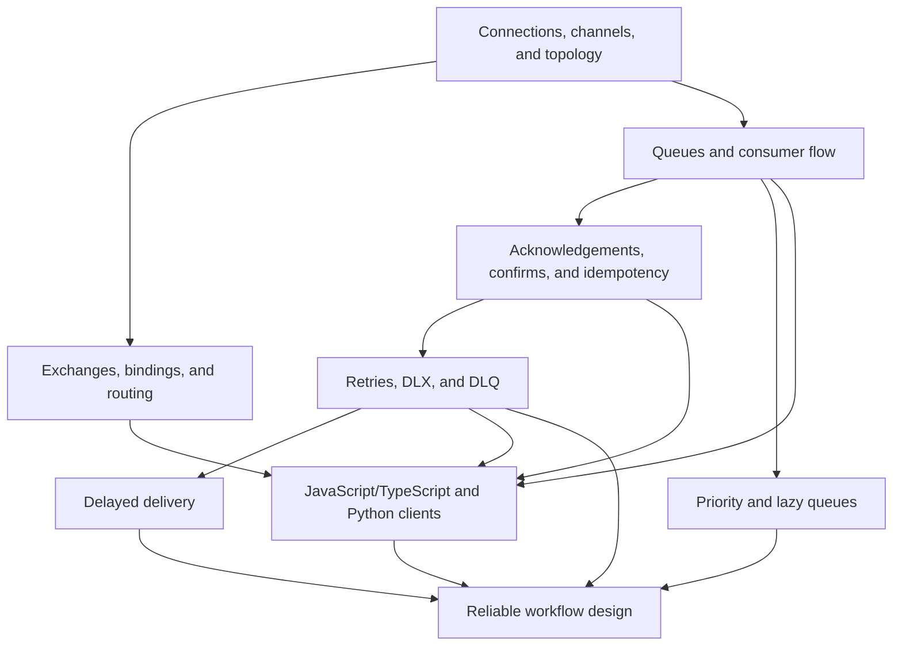

# RabbitMQ Application Integration Knowledge Base

## Executive summary
Reliable RabbitMQ integration is an explicit contract from publisher to broker to handler: topology routes messages, consumer flow bounds in-flight work, acknowledgements report completed handling, and application idempotency makes possible redelivery safe. Publisher confirms and consumer acknowledgements cover different paths; neither alone creates exactly-once business processing.

Use bounded, observable retry paths with a terminal DLQ. Choose delay mechanisms according to the time horizon, isolate service classes when capacity guarantees matter, and treat client code as an implementation of the topology and failure contract.

## Knowledge graph


## Core concepts

### Broker topology and routing
[[nodes/N01-connections-channels-topology|N01 — Connections, channels, and topology]]: a TCP connection is the broker link; channels are lightweight, independent AMQP conversations. Exchanges, queues, and bindings are broker topology. Declare the required topology idempotently before publishing or consuming; incompatible redeclaration is a configuration error.

[[nodes/N02-exchanges-bindings-routing|N02 — Exchanges, bindings, and routing]]: an exchange selects destinations from bindings. Use direct for exact keys, topic for dot-separated patterns (`*` for one word; `#` for zero or more), fanout for copies to every bound destination, and headers only when header matching is the true contract. A publisher routes to an exchange; queues are destinations, not publisher-owned endpoints.

[[nodes/N03-queues-consumer-flow|N03 — Queues and consumer flow]]: a queue is a broker-owned backlog. Consumers on one queue compete; separate queues bound to one exchange receive independent copies. Durable queue metadata and persistent messages are separate protections required for restart survival. Manual acknowledgements plus bounded prefetch cap in-flight work; concurrent consumers, requeues, and priorities weaken simple FIFO expectations.

### Delivery semantics and recovery
[[nodes/N04-acknowledgements-confirms-idempotency|N04 — Acknowledgements, confirms, and idempotency]]: a publisher confirm is broker receipt of publisher-to-broker acceptance. A consumer acknowledgement is handler receipt of broker-to-consumer processing. Acknowledge only after the required durable side effect succeeds. A crash after the effect but before acknowledgement can redeliver, so make the effect idempotent with a stable operation ID, uniqueness constraint, inbox record, or downstream idempotency key.

[[nodes/N05-retries-dlx-dlq|N05 — Retries, DLX, and DLQ]]: a DLX is an ordinary exchange selected when a message is dead-lettered; a DLQ is an ordinary queue bound to that route. Do not use immediate unbounded requeueing as a retry policy. Track attempts, add delay for transient failure, and route exhausted or malformed messages to an owned inspection queue. A terminal DLQ needs alerting, diagnosis, and a controlled replay rule.

[[nodes/N06-delayed-delivery|N06 — Delayed delivery]]: use fixed-TTL retry queues plus DLX for short, predictable retry tiers. Avoid mixed per-message TTLs in one queue when timely expiry matters: an unexpired message ahead can delay an expired one. For long-lived schedules or large delayed backlogs, persist due work in durable scheduling storage and publish when due. The `rabbitmq_delayed_message_exchange` plugin accepts `x-delay`, but is no longer maintained and documents single-node and scale limitations.

### Capacity and implementation
[[nodes/N07-priority-lazy-queues|N07 — Priority and lazy queues]]: priority chooses among ready broker messages; it cannot preempt a lower-priority delivery already held under prefetch. Prefer separate queues and allocated capacity when interactive and batch work need isolation. Classic queues require `x-max-priority`; use a low single-digit range. The historical classic `x-queue-mode=lazy` setting is ignored on current RabbitMQ; it is not a modern queue-mode choice.

[[nodes/N08-javascript-typescript-python-clients|N08 — JavaScript/TypeScript and Python clients]]: amqplib maps the contract to `connect`, `createChannel`, declarations, `publish`, `consume`, `ack`, and `nack`; Pika maps it to `BlockingConnection`, declarations, `basic_publish`, `basic_consume`, `basic_ack`, and `basic_nack`. Set `noAck: false` or `auto_ack=False`, bound prefetch, encode payloads explicitly, and place acknowledgement after the idempotent effect. An async handler needs an explicit error boundary.

[[nodes/N09-reliable-workflow-design|N09 — Reliable workflow design]]: model each message as published, ready, in-flight, completed, retry-waiting, or parked. Every transition needs a declared owner, bounded policy, operational signal, and recovery procedure.

## Cross-concept synthesis
Topology determines where a message can go; consumer credit determines how much work is currently outside the broker; acknowledgements decide which incomplete work can return; idempotency makes that return safe. Retry and delay mechanisms then decide whether failed work waits, repeats, or is parked. Priority and worker allocation decide who gets capacity, while clients faithfully implement these choices.

Reliability therefore is not a broker setting. It is the composition of durable topology, publisher outcome handling, safe handler effects, bounded recovery, and observable operational ownership.

## Methods and decision rules

| Decision | Default rule |
|---|---|
| Routing | Use topic routing for named event families; direct for exact commands; fanout only when every bound queue needs a copy. |
| Consumer concurrency | Start with bounded prefetch based on downstream capacity and processing time. |
| Acknowledgement | Ack only after the required durable effect; `nack`/reject with `requeue=false` for terminal routing. |
| Duplicate protection | Use a stable operation ID and an authoritative uniqueness or idempotency boundary. |
| Transient failure | Use explicit, bounded retry tiers with delay and attempt history. |
| Terminal failure | Park in an owned DLQ; inspect, repair the cause, then replay deliberately. |
| Delay | Fixed TTL/DLX tiers for short retries; durable scheduler storage for long-lived schedules. |
| Service classes | Use separate queues/capacity when fairness or isolation is required; add priority only for a demonstrated ready-message ordering need. |
| Observability | Track queue depth, unacknowledged deliveries, redeliveries, retry volume, DLQ arrivals, and handler latency/errors. |

## Worked examples

### Idempotent payment consumer
Consume `payment.request` manually. In one durable transaction, record `paymentId` under a uniqueness constraint. Invoke the payment provider with that same idempotency key, record the required successful state, then acknowledge. If the process dies after the provider succeeds but before acknowledgement, redelivery observes the prior operation instead of charging again.

### Bounded order retry path
Route `order.created` to `orders.work`. On a transient dependency outage, send the delivery to `orders.retry.10s`, then `orders.retry.1m`, then `orders.retry.10m`; each fixed-TTL queue dead-letters back to the work exchange. After the configured budget, route to `orders.dlq`, preserving death history. The on-call owner investigates the cause before replay.

### TypeScript consumer boundary
```ts
channel.prefetch(10);
channel.consume('orders.work', async message => {
  if (!message) return;
  try {
    await handleOnce(JSON.parse(message.content.toString()));
    channel.ack(message);
  } catch {
    channel.nack(message, false, false);
  }
}, { noAck: false });
```
`handleOnce` must own idempotency and distinguish transient retryable errors from terminal failures according to the workflow policy.

## Practical applications
- Event-driven billing: topic exchange routes `invoice.created` to billing and audit queues; billing uses idempotent processing and bounded retries.
- Background jobs: competing consumers share one work queue; choose prefetch from downstream capacity rather than worker count alone.
- Notifications: use short retry queues for delivery attempts but a scheduler/data store for reminders due weeks or months later.
- Mixed service levels: use separate interactive and batch queues with allocated workers when interactive latency is contractual.

## Common pitfalls
- Treating a publisher confirm as proof that a consumer processed a message, or treating a consumer acknowledgement as proof a publication reached the broker.
- Acknowledging before the required effect, which trades duplicate risk for silent loss.
- Assuming durable queue metadata makes transient messages restart-safe.
- Using immediate requeueing as retry, creating a hot loop.
- Treating a DLQ as automated recovery instead of an owned operational queue.
- Using one mixed-TTL queue where short delays must occur predictably.
- Expecting priority to preempt in-flight work or to provide capacity isolation.
- Relying on the obsolete lazy-queue argument in current RabbitMQ.

## Glossary
- **Ack**: consumer confirmation that the required handling boundary completed.
- **Binding**: exchange-to-destination routing rule.
- **DLX/DLQ**: dead-letter exchange / queue receiving terminal or redirected work.
- **Idempotency key**: stable operation identifier that makes repeated execution safe.
- **Prefetch**: maximum unacknowledged deliveries a consumer may hold.
- **Publisher confirm**: broker confirmation of publisher-to-broker acceptance.
- **Retry tier**: queue with a fixed delay and bounded attempt role.

## Frequently asked questions

### Does RabbitMQ provide exactly-once processing?
No. It provides delivery mechanisms that can repeat work when a receipt is lost. Exactly-once business effects require an idempotent application boundary.

### Does a priority queue guarantee urgent work is immediate?
No. It prioritizes ready messages; messages already delivered within the prefetch window are not preempted.

### Is a DLQ a retry queue?
Not inherently. A DLQ is a destination. A retry path requires intentional routing, delay, bounded attempts, and a terminal policy.

### When should I use the delayed-message plugin?
Only when its maintained-status and operational limitations are acceptable for a short-to-medium delay use case. Do not use it as a general durable calendar.

## Retrieval and practice prompts
- Trace `billing.invoice.paid` through two topic bindings and identify each queue copy.
- Explain why a consumer crash after a committed side effect may redeliver safely.
- Draw a three-tier retry/DLQ path and identify the state change at every edge.
- Translate a manual-ack consumer from amqplib to Pika.
- Design metrics and alerts for a downstream outage before the DLQ grows.

## Further study
- Quorum queues and their delivery/priority trade-offs.
- Transactional outbox and inbox patterns.
- Publisher-confirm batching and back-pressure.
- Broker clustering, policies, monitoring, and disaster recovery.

## Sources
- [Exchanges](https://www.rabbitmq.com/docs/exchanges) — RabbitMQ, accessed 2026-08-30
- [Queues](https://www.rabbitmq.com/docs/queues) — RabbitMQ, accessed 2026-08-30
- [Consumer Acknowledgements and Publisher Confirms](https://www.rabbitmq.com/docs/confirms) — RabbitMQ, accessed 2026-08-30
- [Dead Letter Exchanges](https://www.rabbitmq.com/docs/dlx) — RabbitMQ, accessed 2026-08-30
- [Time-to-Live and Expiration](https://www.rabbitmq.com/docs/ttl) — RabbitMQ, accessed 2026-08-30
- [Priority Support in Queues](https://www.rabbitmq.com/docs/priority) — RabbitMQ, accessed 2026-08-30
- [Classic Queues Operating in "Lazy" Queue Mode](https://www.rabbitmq.com/docs/lazy-queues) — RabbitMQ, accessed 2026-08-30
- [RabbitMQ Delayed Message Plugin](https://github.com/rabbitmq/rabbitmq-delayed-message-exchange) — RabbitMQ, accessed 2026-08-30
- [JavaScript tutorial — Hello World](https://www.rabbitmq.com/tutorials/tutorial-one-javascript) — RabbitMQ, accessed 2026-08-30
- [Python tutorial — Hello World](https://www.rabbitmq.com/tutorials/tutorial-one-python) — RabbitMQ, accessed 2026-08-30
